## 1. Introduction
This blog post aims to show you how to implement a real-time human action recognition pipeline using skeleton-based graph neural networks. It will mainly focus on the application of graphs to this problem as a promising approach with potential explainability.

In skeleton-based action recognition, we work with sequences of body-joint coordinates extracted from video. Compared to image-based recognition, skeletons suppress appearance and background, highlighting motion geometry. Early systems often used RNNs/LSTMs or temporal CNNs over flattened joint vectors; however, these approaches struggle to respect the body’s kinematic structure. Graph neural networks address this by operating directly on the skeleton graph—joints as nodes and bones as edges—enabling them to combine spatial and temporal relations while remaining robust to missing joints.

### 1.1 What you will learn
- Build a real-time skeleton-based action recognition pipeline with graph neural networks.
- Extract and prepare 2D skeleton sequences from raw videos.
- How to augment such skeletons to improve the model's robustness.
- Implement an InfoGCN++ style model with SA-GC encoder, temporal attention, and Neural ODE forecasts.

### 1.2 Possible Applications
The results could be interesting for engineers working on applications that require detecting human actions from video streams.
Pipeline could be used as the first step in various applications, including:
- Video surveillance and detection of dangerous or violent actions;
- Performance monitoring and technique analysis of athletes in sports;
- Detection of abnormal movements during post-surgery rehabilitation.

Additionally, explicit graph structure opens the door to potential explainability of the model's decisions. This is especially important for applications in healthcare and security.

### 1.3. Assumptions
For simplicity and clarity, we restrict the problem. In particular:
- We focus only on a small subset of sport actions (14 actions in total). This keeps the dataset size manageable for a consumer-grade device.
- We implement a pipeline that works with a single person in the frame. This eliminates the need for custom labeling because most available datasets provide only one label per video.
- We focus on the graph-classification task only. For skeleton extraction, we use a pretrained model to avoid training from scratch, which would require a powerful GPU.

With the problem scoped and assumptions established, we next assemble a dataset that aligns with the target actions and constraints.

## 2. Dataset

### 2.1. Source Datasets
We use three datasets, each containing videos with one label per video. Because the datasets contain different action sets and some include non-sport actions, we use only the intersection of labels presented below:
| Action                 | PennAction | UCF101 | Kinetics400 | Count |
|------------------------|------------|--------|-------------|-------|
| squat                  | ✓          | ✓      | ✓           | 389   |
| bench_press            | ✓          | ✓      | ✓           | 344   |
| pullup                 | ✓          | ✓      | ✓           | 341   |
| pushup                 | ✓          | ✓      | ✓           | 333   |
| jump_rope              | ✓          | ✓      | ✗           | 241   |
| jumping_jacks          | ✓          | ✓      | ✗           | 235   |
| clean_and_jerk         | ✓          | ✓      | ✗           | 235   |
| lunges                 | ✗          | ✓      | ✓           | 154   |
| wall_pushups           | ✗          | ✓      | ✗           | 130   |
| situp                  | ✓          | ✗      | ✓           | 130   |
| handstand_pushups      | ✗          | ✓      | ✗           | 128   |
| handstand_walking      | ✗          | ✓      | ✗           | 111   |
| snatch_weight_lifting  | ✗          | ✗      | ✓           | 37    |
| running_on_treadmill   | ✗          | ✗      | ✓           | 11    |
### 2.2. Preprocessing
**Disclaimer**: This section describes preprocessing applied to already-extracted 2D skeleton sequences. Any preprocessing performed on raw videos during pose estimation (e.g., decoding, person tracking, frame-rate normalization) is out of scope for this blog post.

After extracting skeletons, each video is represented as a sequence of raw skeleton graphs. Each graph contains 17 joints, each associated with (x, y, confidence).

  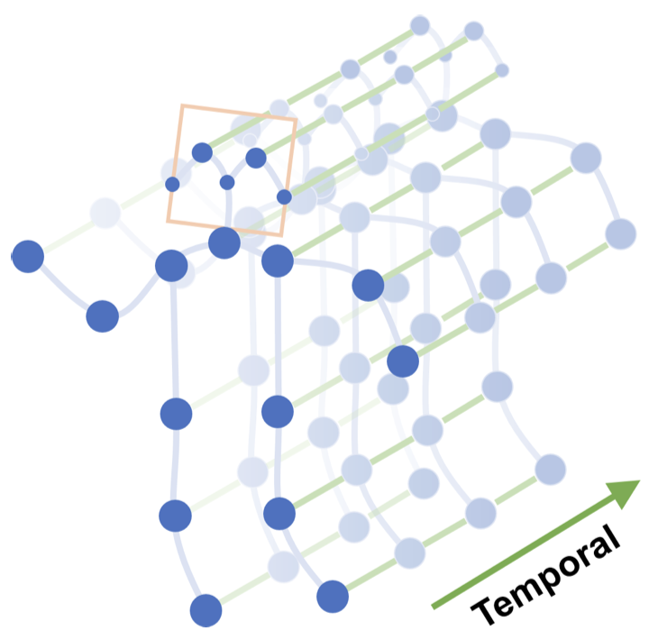 
  <em>Figure 1: Sequence of 2D skeletons extracted per frame from monocular video.</em>

The original model architecture we implement assumes 3D joint coordinates. Our pipeline instead operates on 2D joints from YOLO-Pose, which is a practical adaptation for monocular videos. All subsequent components remain compatible with this 2D setting.

During preprocessing, we perform the following steps:
- **Confidence-aware temporal interpolation**: For each joint and each coordinate `(x, y)`, frames with confidence below a threshold (e.g `0.2`) are treated as missing and linearly interpolated over time using only valid frames. If a joint is missing for the entire sequence, zeros are used.
- **Centering and scale normalization**: We normalize for translation and approximate scale.
  - The origin is set to the pelvis, computed as the midpoint between the left and right hips. We use the first valid pelvis as the reference and subtract it from all frames.
  - The scale is the median torso length over valid frames, where torso length is the distance between the mid-shoulders and the pelvis. All coordinates are divided by this scale (with a small epsilon safeguard).
- **Temporal windowing**: Long skeleton sequences are split into segments using a sliding window with configurable length and stride.

All these steps help to:
- Interpolation reduces the impact of transient keypoint dropouts from the pose estimator.
- Centering and scaling make the model more robust to camera position and subject size (translation and approximate scale invariance) while keeping relative geometry intact.
- Windowing enables training on long videos, stabilizes batch shapes, and supports streaming or online inference scenarios.

### 2.3 Augmentations
Augmentations expand the training set and expose the model to realistic variability, improving robustness and generalization. In our pipeline, we use augmentations at two complementary stages:

We employ augmentations at both the video level (appearance and tempo) and the skeleton level (geometry and time) to reflect real-world variability.
- Video-level (before pose estimation): operate on raw pixels.
- Skeleton-level (after pose estimation): operate directly on joint coordinates and their temporal sequences.

Video-level augmentations
  - **Horizontal mirroring**: simulates left/right viewpoint changes (e.g., left- vs right-handed motions).
    - Applied by flipping each frame horizontally; semantics and labels remain unchanged.
  - **Appearance/illumination changes**: small color and brightness perturbations to mimic different cameras and lighting conditions.
    - Implemented by adjusting saturation/brightness in a perceptual color space to emulate varied exposure and sensors.
  - **Tempo changes**: slight speed-up/slow-down to reflect frame-rate differences and execution pace variation.
    - Performed by uniformly retiming the video while keeping action labels intact.

  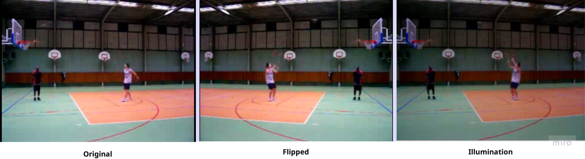 
  <em>Figure 2: Video-level augmentations (horizontal flip, illumination changes, and tempo variation).</em>

Skeleton-level augmentations
  - **Geometric transforms in XY space**: small rotations, uniform scaling, and translations around a stable reference to simulate camera/view shifts without changing action semantics.
    - Rotate around the per-frame centroid; scale uniformly around the centroid; translate by fixed offsets; confidence values are preserved.
  - **Horizontal mirroring in coordinate space**: reflects poses to balance side-dominant actions.
    - Reflect x-coordinates around the per-frame center to create left/right variants of the same motion.
  - **Coordinate jitter**: lightweight noise to model pose-estimator inaccuracies and minor tracking errors.
    - Add small Gaussian perturbations to joint coordinates to increase tolerance to detection noise.
  - **Temporal edits**: cropping subsequences and resampling in time to handle variable action durations and missing frames.
    - Crop a contiguous time window or resample indices to a fixed length; associated confidence values are aligned accordingly.

  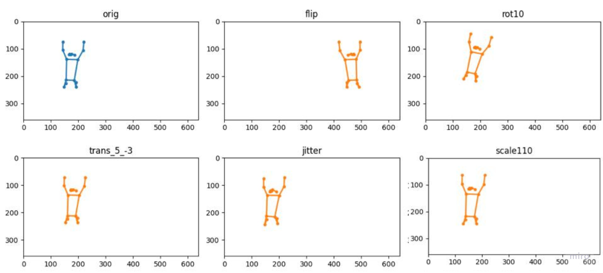 
  <em>Figure 3: Skeleton-level augmentations (rotate, scale, translate, mirror, jitter, temporal edits).</em>

All these steps help to:
- Enlarge the dataset without a new labeling effort.
- Increase invariance to viewpoint, subject size, lighting, camera motion, frame rate, and estimator noise.

## 3. Models
Our pipeline consists of two stages: (1) a pretrained 2D pose estimator that extracts per-frame skeletons; and (2) a skeleton-graph neural network for action recognition. We keep the pose estimator fixed and focus on the graph model as the primary topic of this post.

### 3.1 Pose Estimation Model
We use YOLO11x-pose as an off-the-shelf pose estimator to detect a single person and produce 2D skeletons with 17 keypoints and confidence scores for each frame. This blog post does not cover training or benchmarking the pose estimator; our focus is on the graph-based action recognition component.

### 3.2 Action Recognition Model
Graphs are a natural fit: skeletons are graphs in space and sequences in time, and graph neural networks respect both structures.

#### 3.2.1 Basics of Graph Neural Networks
For readers versed in deep learning but new to graph DL, the key motivation is that skeletons are neither images nor simple sequences. Convolutional networks rely on regular grids with fixed local neighborhoods, while joints live on an irregular kinematic graph with varying degrees and long-range constraints. Recurrent models capture temporal order but do not encode spatial adjacency; flattening joints discards relational structure and permutation invariance. Multilayer perceptrons on concatenated joints ignore locality and are brittle to missing data. However, graph neural networks (GNNs) match the data: they operate directly on nodes and edges, propagating information along bones within a frame and identity links across time.

At its core, a GNN layer updates each node by gathering messages from its neighbors and fusing them with the node’s current state. For a graph \(G=(V,E)\) with node features \(h_v^{(\ell)}\) at layer \(\ell\) and optional edge features \(e_{uv}\), a general message-passing update can be written as
\[
\begin{aligned}
m_v^{(\ell+1)} &= \operatorname{AGG}\left( \left\{\, \operatorname{MLP}_{\phi}^{(\ell)}\left(\begin{bmatrix} h_v^{(\ell)} \\ h_u^{(\ell)} \\ e_{uv} \end{bmatrix}\right) \;\middle|\; u \in \mathcal{N}(v) \right\} \right) \\[1.2em]
h_v^{(\ell+1)} &= \sigma \left( W_h^{(\ell)} h_v^{(\ell)} + W_m^{(\ell)} m_v^{(\ell+1)} + b^{(\ell)} \right )
\end{aligned}
\]

where the aggregator is permutation-invariant (for example, a sum, mean, max, or attention-weighted sum). Stacking such layers expands each joint’s receptive field from immediate neighbors to larger body regions and longer temporal horizons.

  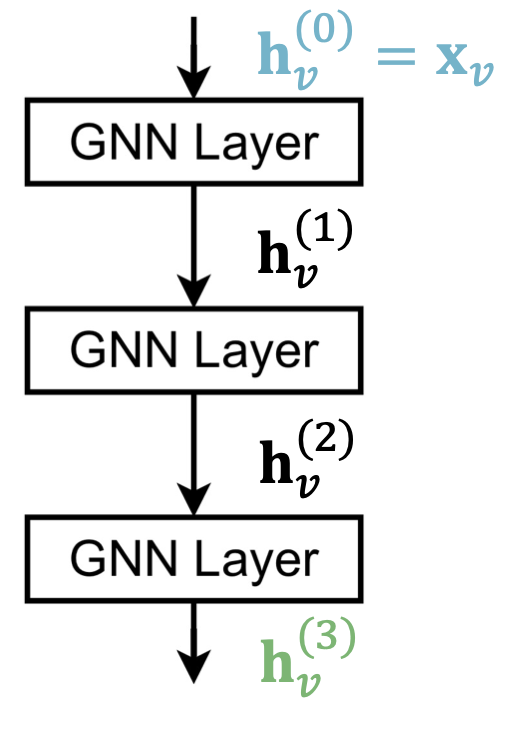 
  <em>Figure 4: Basic GNN stacking architecture.</em>

In our setting, the spatio-temporal skeleton graph has a node for each joint in each frame. Initial node features include normalized \((x, y)\) coordinates and confidence, and can be augmented with simple dynamics such as velocities. Edges connect anatomically adjacent joints within a frame and link the same joint across consecutive frames; this union of spatial and temporal edges allows messages to flow both within the body and forward/backward in time. Neighbor contributions can be reweighted during aggregation to down-weight unreliable joints and emphasize informative relations.

#### 3.2.2 InfoGCN++

##### 3.2.2.1 Self-Attention Graph Convolution
The **Self-Attention Graph Convolution (SA-GC)** module in InfoGCN++ extends the idea of graph convolution by dynamically learning how joints in a skeleton interact, rather than relying only on fixed bone connections. This allows the model to adapt its connectivity depending on the pose and action context.

  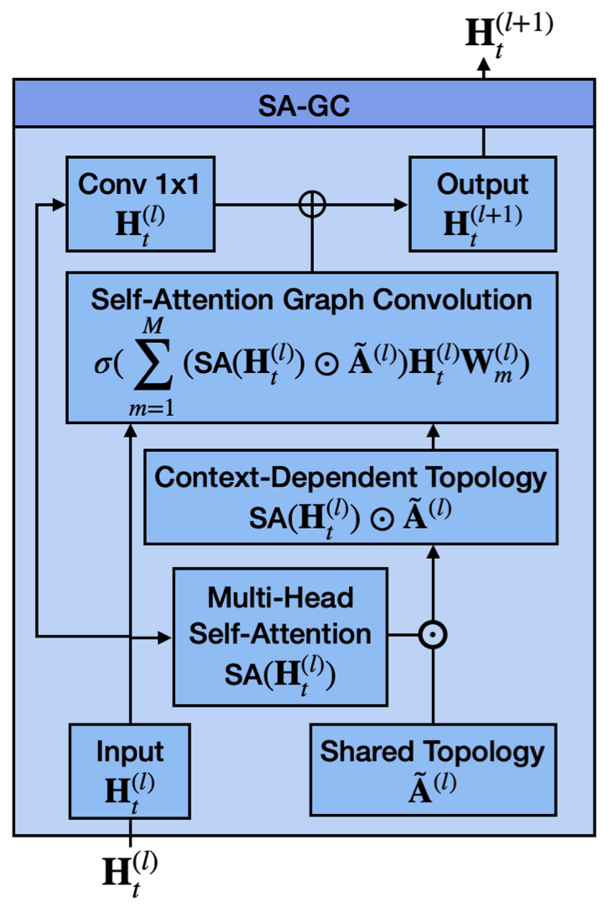 
  <em>Figure 5: Self-Attention Graph Convolution (SA-GC): shared topology combined with attention-derived adjacency.</em>

In human skeletons, the physical bones define a static adjacency — e.g., elbows connect to shoulders and wrists. However, in dynamic actions, the *functional* relationships between joints may vary. For instance, during “jump rope,” the wrists and ankles move in coordination even though they are not directly connected by bones. SA-GC addresses this by introducing **context-dependent adjacency**, inferred via self-attention from the joint features themselves.

**Note**: We repurpose standard Transformer self-attention but over graph nodes rather than token positions — queries and keys are computed from node features, so attention yields node-to-node weights that refine the adjacency.

Let \( H \in \mathbb{R}^{V \times D} \) be the feature matrix of all \(V\) joints, where each node (joint) has a \(D\)-dimensional feature vector. The model first projects \(H\) into *query* and *key* spaces:
\[
Q = H W_Q, \quad K = H W_K,
\]

where \( W_Q, W_K \in \mathbb{R}^{D \times D'} \) are learnable matrices.

The **self-attention map** captures pairwise dependencies between joints:
\[
SA(H) = \operatorname{softmax}\!\left( \frac{K Q^\top}{\sqrt{D'}} \right),
\]

where the softmax is applied row-wise so that each joint’s attention weights over other joints sum to one. This produces a matrix \(SA(H) \in \mathbb{R}^{V \times V}\) describing how strongly each joint attends to every other joint.

To improve modeling capacity, InfoGCN++ uses **multi-head self-attention**. For each head \(m = 1, \dots, M\), the network maintains:
- A learned normalized adjacency matrix \(\hat{A}^m \in \mathbb{R}^{V \times V}\) that encodes stable skeleton connectivity.
- A dynamic self-attention map \(SA^m(H)\) computed from the features.

The two are combined element-wise to form an **effective adjacency**:
\[
A_{\text{eff}}^m = \hat{A}^m \odot SA^m(H),
\]

where \(\odot\) denotes the Hadamard (element-wise) product. This yields a hybrid adjacency: partially fixed (structural) and partially dynamic (contextual).

Here, \(\hat{A}^m\) denotes a normalized adjacency (e.g., symmetric degree normalization) rather than a raw connectivity matrix.

Each SA-GC layer updates the node features as:
\[
H' = \sigma \!\left( \sum_{m=1}^{M} A_{\text{eff}}^m \, H \, W_m \right),
\]

where \(W_m \in \mathbb{R}^{D \times D'}\) is a learned weight matrix for head \(m\), and \(\sigma(\cdot)\) is a nonlinearity such as ReLU.

This formulation generalizes graph convolution — information from neighboring joints is aggregated according to the learned, context-aware connectivity rather than a static adjacency matrix.

We first encode each frame’s graph and subsequently apply temporal attention to capture motion over time.

##### 3.2.2.2 Encoder
The **Encoder** in InfoGCN++ is responsible for transforming sequences of raw skeleton graphs into compact latent representations that capture both spatial and temporal dependencies. It integrates multiple Self-Attention Graph Convolution (SA-GC) layers to model intra-frame (spatial) relationships and Transformer-based temporal self-attention (causal) to model inter-frame (temporal) evolution.

  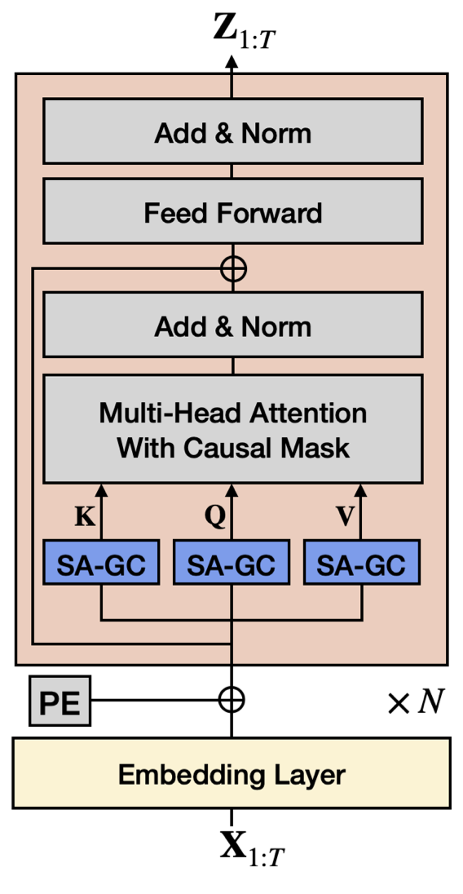 
  <em>Figure 6: Encoder architecture with spatial SA-GC and joint-wise temporal attention.</em>

Each input video segment is represented as a tensor:
\[
X \in \mathbb{R}^{C \times T \times V},
\]

where:
- \(C\) is the number of input channels (e.g., 2D coordinates \((x, y)\) plus confidence → \(C=3\)),
- \(T\) is the number of frames,
- \(V\) is the number of joints per frame.

For each frame \(t\), a spatial skeleton graph is constructed with joints as nodes and anatomical or learned edges as connections. These graphs are then processed frame by frame.

Within each frame, the model applies several **Self-Attention Graph Convolution (SA-GC)** layers (as described in Section 3.2.2.1).  

Each SA-GC layer updates the node features according to:
\[
H_{t}^{(\ell+1)} = \text{SA-GC}\big(H_{t}^{(\ell)}\big),
\]

where \(H_t^{(\ell)}\) denotes the features of all joints in frame \(t\) at layer \(\ell\).

Stacking multiple SA-GC layers expands the receptive field over the skeleton graph, allowing the encoder to learn both local joint relations (e.g., elbow–wrist) and long-range correlations (e.g., ankle–shoulder coordination).

After spatial encoding, temporal dependencies are modeled with **multi-head self-attention (MHSA)** applied **joint-wise along time**. For each joint index \(i\), queries attend only to keys from the current or earlier frames, enforcing online (causal) processing:

\[
\mathrm{Attn}_{t}^{(i)} = \operatorname{softmax}\!\left(\frac{Q_{t}^{(i)} K_{1:t}^{(i)\top}}{\sqrt{D}}\right),
\]

where the softmax is computed over the truncated range \(1{:}t\). The resulting attention weights combine the value vectors \(V_{1:t}^{(i)}\) to produce temporally contextualized features. Each MHSA block is followed by a feed-forward MLP, LayerNorm, and residual connections.

The encoder therefore produces per-frame, per-joint latent features \(Z_t \in \mathbb{R}^{V \times D_z}\). These matrices retain spatial structure until the classification head performs its own pooling, which keeps the representation faithful to the paper’s design.

##### 3.2.2.3 Action Classification Decoder
The **Action Classification Decoder** maps the latent motion representation produced by the encoder into discrete action categories.  

It operates on per-joint latent features \(Z_t \in \mathbb{R}^{V \times D_z}\) — preserving spatial structure — and outputs a probability distribution over all predefined action classes.

  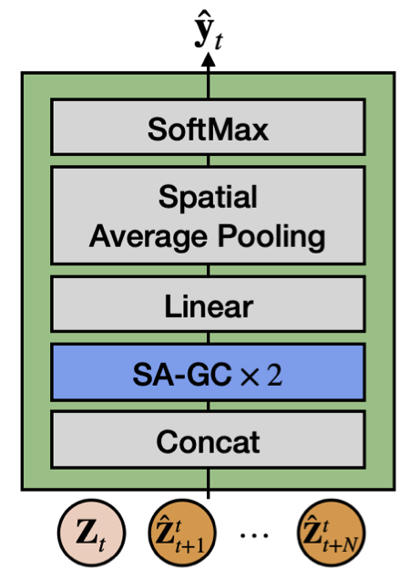 
  <em>Figure 7: Action-classification head with SA-GC layers and per-joint logits followed by spatial mean pooling.</em>

Given the encoder output sequence and the ODE-predicted futures, we concatenate the present latent \(Z_t\) with its rollout \(\hat{Z}_{t+1:t+N}\) along the temporal dimension:

\[
Z^{\mathrm{cat}}_{t} = \mathrm{Concat}\!\big(Z_t,\ \hat{Z}_{t+1},\dots,\hat{Z}_{t+N}\big) \in \mathbb{R}^{(N+1) \times V \times D_z}.
\]

The goal of the decoder is to predict the most likely action label \( \hat{y}_t \) among \(K\) possible classes:

\[
\hat{y}_t = \arg\max_{k \in \{1,\ldots,K\}} p\!\left(y=k \mid Z^{\mathrm{cat}}_{t}\right).
\]

The classification head mirrors the paper: it stacks **two SA-GC layers** followed by a **Linear** projection. The head retains per-joint structure until the final step, where it performs **spatial mean pooling** and then applies **softmax**:

\[
\begin{aligned}
    &H^{(1)}_t = \text{SA-GC}\big(Z^{\mathrm{cat}}_{t}\big), \\[1.2ex]
    &H^{(2)}_t = \text{SA-GC}\big(H^{(1)}_t\big), \\[1.2ex]
    &\ell_t = W_{\text{cls}}\,H^{(2)}_t + b_{\text{cls}}, \\[1.2ex]
    &\bar{\ell}_t = \frac{1}{V}\sum_{v=1}^{V} \ell_t[v], \\[1.2ex]
    &p\!\left(y=k \mid Z^{\mathrm{cat}}_{t}\right) = \operatorname{softmax}\!\big(\bar{\ell}_t\big)_k,
\end{aligned}
\]

where \(W_{\text{cls}}\) is a learnable linear transformation applied per joint.

Since the encoder processes sequences of frames, multiple latent matrices \(\{Z_t\}_{t=1}^T\) may be produced for overlapping temporal windows (e.g., during online or streaming inference).  

Following InfoGCN++, the head evaluates each time step separately using the concatenated futures above, and the video-level prediction can be obtained by averaging the per-step logits or choosing the final step, depending on the evaluation protocol.

##### 3.2.2.4 Neural ODE
Human actions evolve continuously in time. Modeling the latent state Z as the solution of a differential equation \(\tfrac{dZ}{d\tau} = f_\theta(Z, \tau)\) encourages smooth dynamics, allows variable-step integration, and enables short-horizon forecasting more flexibly than strictly discrete RNNs or temporal convolutions.

We model the evolution of the latent state as a **continuous-time dynamical system**. Let \(Z(\tau)\) denote the latent representation (per joint or globally pooled) at time \(\tau\). A learnable dynamics function \(f_\theta\) predicts its **time derivative**:

\[
\frac{dZ(\tau)}{d\tau} = f_\theta\!\big(Z(\tau), \tau\big), 
\qquad Z(t_0) = Z_0.
\]

Here, \(f_\theta\) is a neural network (a small SA-GC stack in our case) trained **to predict the derivative** of the latent state. Following InfoGCN++, we inject **sinusoidal temporal positional embeddings** before each SA-GC block inside \(f_\theta\) so that the dynamics function is aware of absolute time during the rollout. To obtain future latents, we **integrate** this initial value problem forward in time using a numerical ODE solver.

With step size \(h>0\) and discrete times \(t_n = t_0 + n h\), the classical 4th-order Runge–Kutta update is:
\[
\begin{aligned}
k_1 &= f_\theta\!\big(Z_n,\ t_n\big),\\
k_2 &= f_\theta\!\big(Z_n + \tfrac{h}{2}k_1,\ t_n + \tfrac{h}{2}\big),\\
k_3 &= f_\theta\!\big(Z_n + \tfrac{h}{2}k_2,\ t_n + \tfrac{h}{2}\big),\\
k_4 &= f_\theta\!\big(Z_n + h\,k_3,\ t_n + h\big),\\
Z_{n+1} &= Z_n + \frac{h}{6}\,\big(k_1 + 2k_2 + 2k_3 + k_4\big).
\end{aligned}
\]

Rolling this update \(N\) times yields future latent states \(\{Z_{t_0+h}, Z_{t_0+2h}, \dots, Z_{t_0+Nh}\}\) at a frame-aligned grid when \(h=1\) (in “frames”). 

We also decode predicted latents back to joints, adding a concrete motion-prediction objective.

##### 3.2.2.5. Future Motion Decoder
The **Future Motion Decoder** uses the Neural ODE rollout to **anticipate** upcoming poses and provides an auxiliary supervision signal that sharpens the encoder’s spatio-temporal features.

  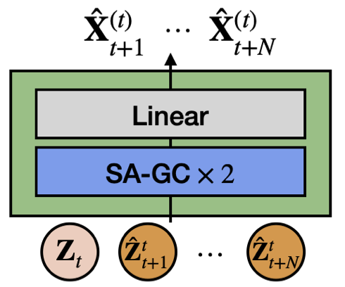 
  <em>Figure 8: Future-motion decoder that reconstructs joint coordinates from predicted future latents.</em>

Given the current latent \(Z_t\) from the encoder, we integrate the Neural ODE forward for \(N\) steps:

\[
\hat{Z}_{t+1:t+N} \;=\; \mathrm{RK4}\!\big(f_\theta,\ Z_t,\ N,\ h=1\big)
\;=\; \{\hat{Z}_{t+1}, \hat{Z}_{t+2}, \dots, \hat{Z}_{t+N}\}.
\]

This produces predicted future latents aligned to the next \(N\) frames.

  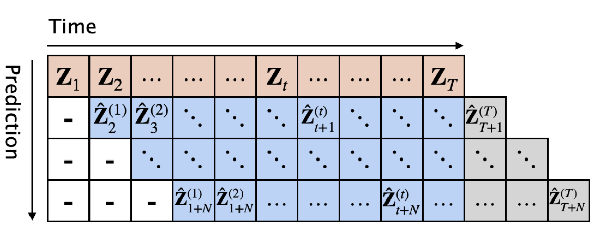 
  <em>Figure 9: Alignment of predicted future latents with upcoming frames.</em>

Each predicted latent is mapped back to joint coordinates via a lightweight graph decoder:

\[
\hat{X}_{t+n} \;=\; \mathrm{Dec}\!\big(\hat{Z}_{t+n}\big)
\;=\; \mathrm{Linear}\!\Big(\mathrm{GCN}_2\!\big(\mathrm{GCN}_1(\hat{Z}_{t+n})\big)\Big),
\quad n=1,\dots,N,
\]

yielding \(\hat{X}_{t+n}\in\mathbb{R}^{V\times C_{\text{out}}}\) (e.g., \(C_{\text{out}}=2\) for \((x,y)\), optionally plus confidence/velocity).

At time \(t\), the classifier consumes both present and predicted futures via the concatenation defined in Section 3.2.2.3:

\[
\tilde{Z}_t \;=\; \mathrm{Concat}\!\big(Z_t,\ \hat{Z}_{t+1:t+N}\big).
\]

## 4. Training
Training couples three objectives — classification, motion prediction, and feature consistency—so that the encoder learns actionable dynamics.

For training, we use the same pipeline as the official implementation shown in Figure 10.

  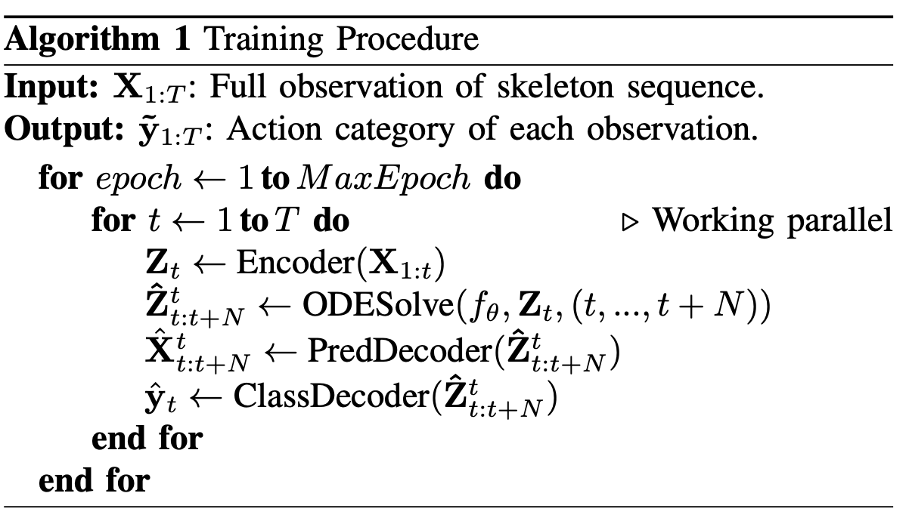 
  <em>Figure 10: Training pipeline with classification, feature-consistency, and motion-prediction branches.</em>

As a result, we observe the evolution of the model during training depicted in Figure 11.

  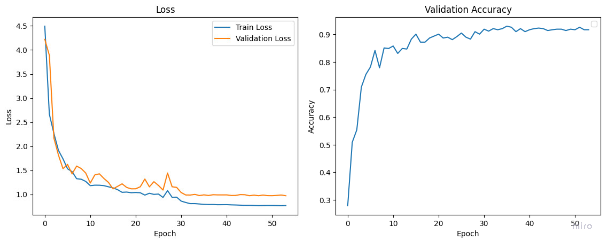 
  <em>Figure 11: Training curves for loss components and accuracy over epochs.</em>

### 4.1 Objective Function
Predicting future motion forces the encoder’s latent \(Z\) to capture not only the present pose but also likely upcoming dynamics, which improves the discriminative features consumed by the classification head. The feature-consistency loss aligns predicted future latents with latents encoded from the true future, regularizing the latent space and stabilizing training; together with joint-space motion prediction, this encourages representations that are both predictive and class-informative.

We train the model with a **multi-task objective** that couples action classification with future-motion prediction in both joint space and latent space.

#### 4.1.1 Motion-prediction loss (joint space)
Let \(X_t \in \mathbb{R}^{V\times C_{\text{out}}}\) be the ground-truth skeleton at time \(t\) and \(\hat{X}^{(t)}_{t+n}\) the decoder’s prediction for the next \(n\) frames produced from the current latent \(Z_t\).
The **prediction loss** averages an MSE over all valid future steps (frames beyond \(T\) are omitted):

\[
\mathcal{L}_{\text{pred}}
=\frac{1}{K}\sum_{n=1}^{N}\sum_{t=1}^{T-n}
\operatorname{MSE}\!\big(\hat{X}^{(t)}_{t+n},\, X_{t+n}\big),\qquad
K = N T - \frac{N(N+1)}{2}.
\]

#### 4.1.2 Feature-consistency loss (latent space)
Denote by \(\hat{Z}^{(t)}_{t+n}\) the **predicted future latent** obtained by ODE rollout from \(Z_t\), and by \(Z_{t+n}=\text{Encoder}(X_{1:t+n})\) the **true future latent** encoded from the observed prefix up to \(t{+}n\).

The **feature loss** aligns predicted and true futures:

\[
\mathcal{L}_{\text{feat}}
=\frac{1}{K}\sum_{n=1}^{N}\sum_{t=1}^{T-n}
\operatorname{MSE}\!\big(\hat{Z}^{(t)}_{t+n},\, Z_{t+n}\big).
\]

#### 4.1.3 Action-classification loss
Let \(\hat{y}_t=\text{ClassHead}(\cdot)\) be the per-time-step class distribution and \(y\) the one-hot ground-truth label over \(C\) classes.

The **classification loss** is cross-entropy (with label smoothing, \(\epsilon{=}0.1\)):

\[
\mathcal{L}_{\text{cls}}
= -\frac{1}{T\,C}\sum_{t=1}^{T}\sum_{c=1}^{C}
y[c]\,\log\!\big(\hat{y}_t[c]\big).
\]

#### 4.1.4 Total objective
The overall training objective combines all terms:

\[
\mathcal{L} = \mathcal{L}_{\text{cls}} + \lambda_{1}\,\mathcal{L}_{\text{pred}} + \lambda_{2}\,\mathcal{L}_{\text{feat}}
\]

where \(\lambda_{1}\) and \(\lambda_{2}\) control the contribution of motion prediction and feature-consistency, respectively.

### 4.2 Hyperparameters
We intentionally deviate from the official InfoGCN++ training recipe to better suit our smaller, noisier sport-action subset. The paper reports SGD with **70 epochs**, **base lr 0.1**, **weight decay 3e-4**, **batch size 64**, and loss weights \(\lambda_1 = 10^{-1}, \lambda_2 = 10^{-3}\). In contrast, we adopt the configuration below (notably lr \(=10^{-2}\), 55 epochs, weight decay \(=10^{-4}\), batch size 32, and \(\lambda_2 = 10^{-1}\)) while keeping other pipeline components unchanged.

| Hyperparameter      | Value           |
|---------------------|-----------------|
| epochs              | 55              |
| base_lr             | 1e-2            |
| optimizer           | SGD             |
| weight_decay        | 1e-4            |
| warmup_epochs       | 5               |
| lr_steps            | [30, 45, 60]    |
| lr_decay            | 0.1             |
| grad_clip           | 1.0             |
| batch_size          | 32              |
| p_interval_train    | (0.5, 1.0)      |
| p_interval_val      | (0.95,)         |
| random_rotation     | True            |
| use_velocity        | False           |
| preload             | True            |
| preload_to_tensor   | True            |
| lambda_1            | 0.1             |
| lambda_2            | 0.1             |
## 5. Evaluation

#### 5. Evaluation
We evaluate the best checkpoint on a stratified test split and report macro metrics to mitigate class imbalance.

We held out **20%** of the data as a **stratified test split** (stratification on action labels). During training, we selected the **best checkpoint by validation accuracy** and evaluated that checkpoint on the test set.

| Metric           | Score    |
|------------------|----------|
| Macro Precision  | **0.9170** |
| Macro Recall     | **0.8887** |
| Macro F1         | **0.8996** |
| Accuracy         | **0.9302** |

*Rationale:* We report **macro** metrics as primary since they weight each class equally and are more robust to class imbalance.

These results indicate strong generalization across the selected actions.

## 6. Reproduction
This blog post describes the rationale and high-level implementation of the building blocks of the pipeline. The full implementation is available in the [GitHub repository](https://github.com/KosmonikOS/Action_Recognition).

To reproduce the whole study, please follow the instructions in the [Reproduction section](https://github.com/KosmonikOS/Action_Recognition/blob/main/README.md#reproduction), [Data pipeline docs](https://github.com/KosmonikOS/Action_Recognition/blob/main/docs/prepare_data.md), and [Training pipeline docs](https://github.com/KosmonikOS/Action_Recognition/blob/main/docs/train_pipeline.md).

If you are interested in only using an already trained model, follow the instructions in the [Usage section](https://github.com/KosmonikOS/Action_Recognition/blob/main/README.md#usage). Currently, the model is ready to be used as a standalone API endpoint or as a Streamlit app.

## 7. References
[1] S. Chi, H.-G. Chi, Q. Huang, and K. Ramani, “InfoGCN++: Learning Representation by Predicting the Future for Online Human Skeleton-based Action Recognition,” arXiv preprint arXiv:2310.10547, Oct. 2023. [Online]. Available: https://arxiv.org/abs/2310.10547  

[2] S. Yan, Y. Xiong, and D. Lin, “Spatial-Temporal Graph Convolutional Networks for Skeleton-Based Action Recognition,” arXiv preprint arXiv:1801.07455, Jan. 2018. [Online]. Available: https://arxiv.org/abs/1801.07455  

[3] M. Feng and J. Meunier, “Skeleton Graph-Neural-Network-Based Human Action Recognition: A Survey,” *Sensors*, vol. 22, no. 6, art. 2091, Mar. 2022. [Online]. Available: https://www.mdpi.com/1424-8220/22/6/2091  

[4] “PennAction Dataset,” DreamDragon. [Online]. Available: http://dreamdragon.github.io/PennAction/  

[5] “UCF101: A Dataset of 101 Human Actions Classes from Videos in the Wild,” Center for Research in Computer Vision, University of Central Florida. [Online]. Available: https://www.crcv.ucf.edu/data/UCF101.php  

[6] W. Kay, J. Carreira, K. Simonyan et al., “The Kinetics Human Action Video Dataset,” arXiv preprint arXiv:1705.06950, May. 2017. [Online]. Available: https://arxiv.org/abs/1705.06950  

[7] “YOLO-Pose Task Documentation,” Ultralytics. [Online]. Available: https://docs.ultralytics.com/tasks/pose/  

[8] “Neural Ordinary Differential Equations — Tutorial,” UVA DLC Notebooks. [Online]. Available: https://uvadlc-notebooks.readthedocs.io/en/latest/tutorial_notebooks/DL2/Dynamical_systems/dynamical_systems_neural_odes.html  

