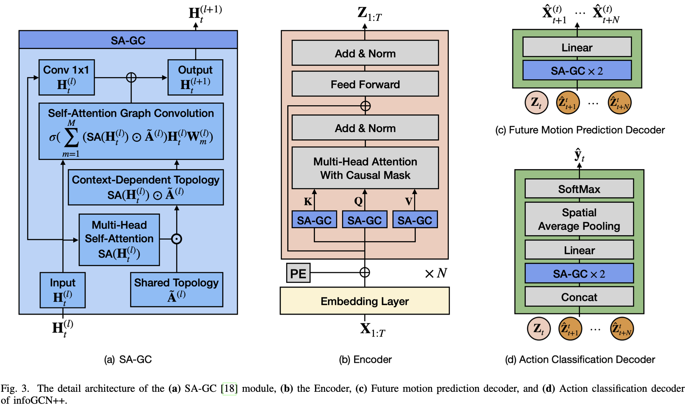

## 0. Team Information
Members:
- Nikita Tiurkov (n.tiurkov@innopolis.university)
- Alexandra Starikova-Nasibullina (a.nasibullina@innopolis.university)

## 1. Project Information (Human Action Recognition in a Real-Time Video Stream)
### 1.1. Description
This project aims to develop a pipeline that allows to detect human actions in a real-time video stream. Due to the time constraints, we will focus only on sport activities.

### 1.2. Goals (What we plan to do)
- Collect a dataset of videos:
    - Different lengths of videos
    - Different actions (including videos without actions)
    - Different combinations of actions (when person do different things in the same video)
    - Different backgrounds
- Create a pipeline for action classification
    - Components:
        - Video pre-processing/standartisation pipeline.
        - Model for 2D skeleton extraction (including human detection, joints detection and graph construction).
        - Model for action classification (assign label for each timeframe).
    - Requirements:
        - Efficient enough to work with stream video data on a consumer-grade GPU (e.g Apple M-series chips).
        - Work in different environments including:
            - Traits of humans (sex, race, height, etc.)
            - Backgrounds
            - Traits of video (aspect ratios, angles, etc.)
            - Clothes
- Write a well-documented methodology on how to reproduce the results on external datasets (potentially, not connected with sport actions).
- As we will have a custom dataset (both for train and test), we won't be able to directly compare our results with SOTA models (due to different labels).

### 1.3. Anti-goals (What we don't plan to do)
- We won’t make a pipeline that could work with a wide range of actions out of the box (instead we focus mainly on sport actions).
- We won’t focus on beating overall SOTA models in quality. We aim for a balance between quality and inference speed of the system.
- We won’t use videos with  multiple people in the frame as it would require a much more complex labeling schema.
- We won’t build 3D skeletons as it would require either multi-view cameras or reliance on coarse heuristics
- We won't train skeleton detection model from scratch as it would require access to GPU cluster (e.g model that we plan to use was trained on 8 NVIDIA A100 GPUs).

### 1.4. End-Users
The results of this project could be interested for engineers who are working on applications that require human actions detection from the video stream.
Our pipeline could be used as the first step in various applications, including:
- Video surveillance and detection of dangerous or violent actions;
- Performance monitoring and technique analysis of athletes in sports;
- Detection of abnormal movements during post-surgery rehabilitation.

## 2. Datasets
As we decided not to train skeleton detection model from scratch, we will only need to collect a dataset of videos with annotated actions. We plan to use datasets described in [5], [6] and [7]. As datasets contain different action sets and some of them contain non-sport related actions, we are going to use only the intersection of labels presented below:

| label                  | PennAction | PennAction\_name    | UCF101 | UCF101\_name          | Kinetics400 | Kinetics400\_name        |
|------------------------|------------|---------------------|--------|-----------------------|-------------|--------------------------|
| bench\_press           | True       | bench\_press        | True   | Bench Press           | True        | bench pressing           |
| squat                  | True       | squats              | True   | Body Weight Squats    | True        | squat                    |
| clean\_and\_jerk       | True       | clean\_and\_jerk    | True   | Clean and Jerk        | False       |                          |
| handstand\_pushups     | False      |                     | True   | Handstand Pushups     | False       |                          |
| handstand\_walking     | False      |                     | True   | Handstand Walking     | False       |                          |
| jumping\_jacks         | True       | jumping\_jacks      | True   | Jumping Jack          | False       |                          |
| jump\_rope             | True       | jump\_rope          | True   | Jump Rope             | False       |                          |
| lunges                 | False      |                     | True   | Lunges                | True        | lunge                    |
| pull\_ups              | True       | pull\_ups           | True   | Pull Ups              | True        | pull ups                 |
| push\_ups              | True       | push\_ups           | True   | Push Ups              | True        | push up                  |
| running\_on\_treadmill | False      |                     | False  |                       | True        | running on treadmill     |
| sit\_ups               | True       | sit\_ups            | False  |                       | True        | situp                    |
| snatch\_weight\_lifting| False      |                     | False  |                       | True        | snatch weight lifting    |
| wall\_pushups          | False      |                     | True   | Wall Pushups          | False       |                          |

Videos that contains multiple people in the frame will be excluded from the resulting dataset.

This datasets are applicable for our project as they contain 2D videos shot from a single camera, which simulates consumer-grade video stream.

## 3. Preliminary Research

### 3.1. Skeleton Detection

To extract skeleton graphs from raw videos we will run a [YOLOv11](https://arxiv.org/pdf/2410.17725v1) pose estimation pipeline that simultaneously performs single-person detection and keypoint localisation. Each processed frame is converted into a graph whose nodes correspond to the 17 detected joints and whose edges follow the canonical human skeleton topology; stacking these graphs over time yields the `(num_frames, 17, 2)` sequences used downstream. The internal architecture of YOLO11 is outside the current project scope, so we will rely on an officially released pretrained checkpoint.

### 3.2. Action Classification

**InfoGCN++** for online skeleton-based action recognition. It encodes observed frames, **extrapolates** their latent trajectory to future frames via an ODE solver, and classifies actions using both observed and anticipated latent representations. Even though that the initial architecture was designed for 3D skeletons, we will adapt it to 2D skeletons. In other aspects the architecture is fully compatible with our dataset.

**Inputs & embedding.** Each frame $X_t \in \mathbb{R}^{V\times 3}$ (V joints) is projected to a D-dimensional feature $H_t$ (linear + positional encoding), then passed to the spatial encoder. (See Fig. 3.)

**Spatial encoder — Self-Attention Graph Convolution (SA-GC).**

SA-GC injects a learned, content-adaptive attention into graph convolution by re-weighting base adjacency ($\tilde A_m$) with a self-attention matrix ($\mathrm{SA}(H)$), using the Hadamard product ($\odot$):
$$
\begin{aligned}
\text{SA-GC}(H) &= \sigma \left( \sum_{m=1}^{M} \left( \tilde{A}_m \odot \mathrm{SA}(H) \right) H W_m \right), \\
\mathrm{SA}(H) &= \mathrm{softmax} \left( HW_K (HW_Q)^\top/\sqrt{D'} \right).
\end{aligned}
\tag{1}
$$
**Why:** it preserves the skeletal prior (graph convolution on joints) but **adapts the effective topology** to the pose context via attention. (Fig. 3a.)

**Temporal encoder — Causal attention over time.**

For online use, attention at time $t$ only attends to $1{:}t$ (no future leak). Attention is computed **per joint index** $i$, i.e., along the time axis of each joint’s features:

$$
\begin{aligned}
\mathrm{Attention}_t[i]
&= \mathrm{Softmax}\left(\frac{Q_t[i] K_{1{:}t}[i]^\top}{\sqrt{D}}\right) V_{1{:}t}[i],
\qquad 1 \leq i \leq V.
\end{aligned}
\tag{2}
$$
This yields an observation-time latent $Z_t$. (Fig. 3b.)

**Neural-ODE future predictor — latent extrapolation.**

Given $Z_t$, predict future latents by solving an **initial value problem (IVP)** with ODE function $f_\theta$ (stacked SA-GC layers with temporal positional embeddings):
$$
\hat{Z}^{(t)}_{t{:}t+N} = \mathrm{ODESolve}\left(f_\theta, Z_t, (t, \ldots, t{+}N)\right),
$$
with $\hat{Z}^{(t)}_{t} = Z_t$; a Runge–Kutta solver is used. (Figs. 2, 3c.)

**Why:** online recognition benefits from **anticipated evidence**—continuous-time dynamics let the model forecast motion beyond the last observed frame.

**Task-specific heads & losses.**

* **Future motion decoder:** maps each $\hat{Z}^{(t)}_{t+n}$ to predicted joints $\hat{X}^{(t)}_{t+n}$ (2× GCN + Linear) with coordinate MSE; additionally aligns $\hat{Z}^{(t)}_{t+n}$ to the encoder’s true future $Z_{t+n}$ via a feature MSE:
  $$
  \begin{aligned}
  \mathcal{L}_{\text{pred}}
  &=\frac{1}{K}\sum_{n=1}^N\sum_{t=1}^{T-n} \mathrm{MSE}\left(\hat{X}^{(t)}_{t+n}, X_{t+n}\right), \\
  \mathcal{L}_{\text{feat}}
  &=\frac{1}{K}\sum_{n=1}^N\sum_{t=1}^{T-n} \mathrm{MSE}\left(\hat{Z}^{(t)}_{t+n}, Z_{t+n}\right).
  \end{aligned}
  \tag{3}
  $$
* **Classification head:** concatenates $[\hat{Z}^{(t)}_{t},\ldots,\hat{Z}^{(t)}_{t+N}]$, applies 2× SA-GC + Linear + spatial mean pooling + Softmax to produce $\hat{y}_t$, trained with cross-entropy. (Fig. 3d.)

**Total objective (multi-task).**
$$
\mathcal{L} = \mathcal{L}_{\text{cls}} + \lambda_1 \mathcal{L}_{\text{pred}} + \lambda_2 \mathcal{L}_{\text{feat}}.
\tag{4}
$$
Joint training makes latents both **discriminative** (classification) and **forecastable** (prediction/feature losses), improving early/online recognition.

**Figure placeholders to insert:**

 Figure 2. Overview of InfoGCN++.

 Figure 3. Module details of InfoGCN++.

## 4. Github Repository
https://github.com/KosmonikOS/Action_Recognition
