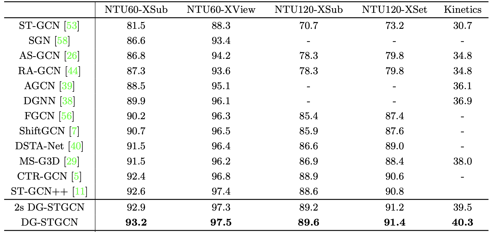

## 1. Team Information (JustTeam)
Members:
- Nikita Tiurkov (n.tiurkov@innopolis.university)
- Viktor Mazanov (v.mazanov@innopolis.university)
- Oleg Shchendrigin (o.shchendrigin@innopolis.university)

## 2. Project Information (Human Action Recognition in a Real-Time Video Stream)
### 2.1. Description
This project aims to develop a pipeline that allows to detect human actions in a real-time video stream. Due to the time constraints, we will focus only on sport activities.

### 2.2. Goals (What we plan to do)
- Collect a dataset of videos:
    - Different lengths of videos
    - Different actions (including videos without actions)
    - Different combinations of actions (when person do different things in the same video)
    - Different backgrounds
- Create a pipeline for action classification
    - Components:
        - Video pre-processing/standartisation pipeline.
        - Model for 2D skeleton extraction (including human detection, joints detection and graph construction).
        - Model for action classification (assign label for each timeframe).
    - Requirements:
        - Efficient enough to work with stream video data on a consumer-grade GPU (e.g Apple M-series chips).
        - Work in different environments including:
            - Traits of humans (sex, race, height, etc.)
            - Backgrounds
            - Traits of video (aspect ratios, angles, etc.)
            - Clothes
- Write a well-documented methodology on how to reproduce the results on external datasets (potentially, not connected with sport actions).
- As we will have a custom dataset (both for train and test), we won't be able to directly compare our results with SOTA models (due to different labels).

### 2.3. Anti-goals (What we don't plan to do)
- We won’t make a pipeline that could work with a wide range of actions out of the box (instead we focus mainly on sport actions).
- We won’t focus on beating overall SOTA models in quality. We aim for a balance between quality and inference speed of the system.
- We won’t use videos with  multiple people in the frame as it would require a much more complex labeling schema.
- We won’t build 3D skeletons as it would require either multi-view cameras or reliance on coarse heuristics
- We won't train skeleton detection model from scratch as it would require access to GPU cluster (e.g model that we plan to use was trained on 8 NVIDIA A100 GPUs).

### 2.4. End-Users
The results of this project could be interested for engineers who are working on applications that require human actions detection from the video stream.
Our pipeline could be used as the first step in various applications, including:
- Video surveillance and detection of dangerous or violent actions;
- Performance monitoring and technique analysis of athletes in sports;
- Detection of abnormal movements during post-surgery rehabilitation.

## 3. Preliminary Research

### 3.1. Skeleton Detection
For skeleton detection task (sometimes called keypoint detection or pose estimation) we compared three pretrained models from [1], [2] and [3]. Below we present a comparison table:

| Model Name | Inference Speed (FPS)| GPU Used            | AP**   | Dataset*       |
|------------|----------------------|---------------------|------|---------------|
| RTMPose    | 430                  | NVIDIA GTX 1660 Ti  | 75.8 | COCO val2017  |
| ViTPose    | 241                  | NVIDIA A100         | 68.8 | MS COCO       |
| TinyPose   | 333                  | NVIDIA GTX 1660 Ti  | 80.9 | COCO val2017  |
\* We aren't sure that COCO val2017 using in [1] and MS COCO in [2] are the same datasets (they could differ in year of release).
\*\* AP in sceleton detection, not in the e2e action recognition.

As one of the goal is balance between accuracy and inference efficiency on consumer-grade GPU (which is not the case of A100), we decided to use RTMPose pretrained model.

### 3.2. Action Classification

### 3.2 Action Classification

Graph spatial-temporal networks are the standard choice for action recognition from skeleton data. Two representative architectures are **ST-GCN** [4] and **DG-STGCN** [5].  

Below you could check the comparison table between various modification of ST-GCN [5].

Note that reported AP isn't e2e action recognition from raw video, but action recognition from sceleton data.

As stated in [5], "DG-STGCN achieves significant improvements on multiple bench- marks while preserving the model efficiency." Hence, we will use this archirecture for action classification.

## 4. Datasets
As we decided not to train skeleton detection model from scratch, we will only need to collect a dataset of videos with annotated actions. We plan to use datasets described in [5], [6] and [7]. As datasets contain different action sets and some of them contain non-sport related actions, we are going to use only the intersection of labels presented below:

| label                  | PennAction | PennAction\_name    | UCF101 | UCF101\_name          | Kinetics400 | Kinetics400\_name        |
|------------------------|------------|---------------------|--------|-----------------------|-------------|--------------------------|
| bench\_press           | True       | bench\_press        | True   | Bench Press           | True        | bench pressing           |
| squat                  | True       | squats              | True   | Body Weight Squats    | True        | squat                    |
| clean\_and\_jerk      | True       | clean\_and\_jerk   | True   | Clean and Jerk        | False       |                          |
| handstand\_pushups     | False      |                     | True   | Handstand Pushups     | False       |                          |
| handstand\_walking     | False      |                     | True   | Handstand Walking     | False       |                          |
| jumping\_jacks         | True       | jumping\_jacks      | True   | Jumping Jack          | False       |                          |
| jump\_rope             | True       | jump\_rope          | True   | Jump Rope             | False       |                          |
| lunges                 | False      |                     | True   | Lunges                | True        | lunge                    |
| pull\_ups              | True       | pull\_ups           | True   | Pull Ups              | True        | pull ups                 |
| push\_ups              | True       | push\_ups           | True   | Push Ups              | True        | push up                  |
| running\_on\_treadmill | False      |                     | False  |                       | True        | running on treadmill     |
| sit\_ups               | True       | sit\_ups            | False  |                       | True        | situp                    |
| snatch\_weight\_lifting| False      |                     | False  |                       | True        | snatch weight lifting    |
| wall\_pushups          | False      |                     | True   | Wall Pushups          | False       |                          |

Videos that contains multiple people in the frame will be excluded from the resulting dataset.

## 5. Project Plan and Work Distribution
For now the high-level plan looks like this:
1. Understand how to inference RTMPose (Nikita):
    - Understand MMPose inference toolkit;
    - Experiment with different RTMPose model sizes (S, M, L);
    - Experiment with different inference engines (Pytorch, ONNX, TensorRT)
2. Write a module for efficient RTMPose inference on video stream (Nikita):
    - Understand how to convert video to format accepted by RTMPose;
    - Understand the output format of RTMPose;
    - Write converted from RTMPose output format to PyG graph format.
3. Prepare the dataset with video-action pairs (Victor and Oleg):
    - Download the datasets;
    - Normalize labels and videos (aspect ratio, etc.);
    - Filter on the intersection of labels;
    - Prepare module to detect multiple people in the frame and discard such videos.
4. Prepare the dataset with sceleton-action pairs (TBD):
    - Convert videos from step 3 into sceletons via module from step 2;
    - Define an appropriate time segments (such that one video could contain multiple actions);
    - Save them in PyG graph format.
5. Train DG-STGCN model (TBD):
    - Write necessary parts on Pytorch;
    - Define an appropritate Train-Test split;
    - Train the model;
    - Evaluate the model on the test set.
6. Wrap the resulting pipeline into a service (TBD):

## 6. Github Repository
https://github.com/KosmonikOS/Action_Recognition

## 7. References
1. [RTMPose: Real-Time Multi-Person Pose Estimation based on MMPose](https://arxiv.org/pdf/2303.07399)
2. [ViTPose: Simple Vision Transformer Baselines for Human Pose Estimation](https://arxiv.org/pdf/2204.12484)
3. [TinyPose](https://github.com/PaddlePaddle/PaddleDetection/blob/release/2.8.1/configs/keypoint/tiny_pose/README_en.md)
4. [Spatial Temporal Graph Convolutional Networks for Skeleton-Based Action Recognition](https://arxiv.org/pdf/1801.07455)
5. [DG-STGCN: Dynamic Spatial-Temporal Modeling for Skeleton-based Action Recognition](https://arxiv.org/pdf/2210.05895)
6. [Penn Action Dataset](http://dreamdragon.github.io/PennAction/)
7. [UCF101 - Action Recognition Data Set](https://www.crcv.ucf.edu/data/UCF101.php)
8. [The Kinetics Human Action Video Dataset](https://arxiv.org/pdf/1705.06950)