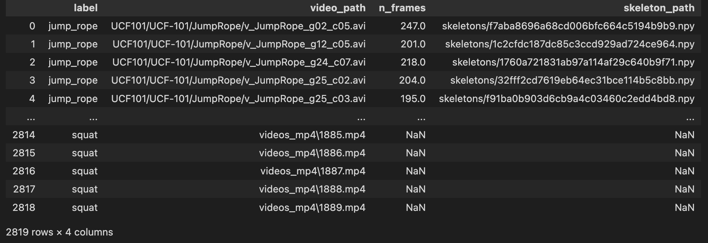
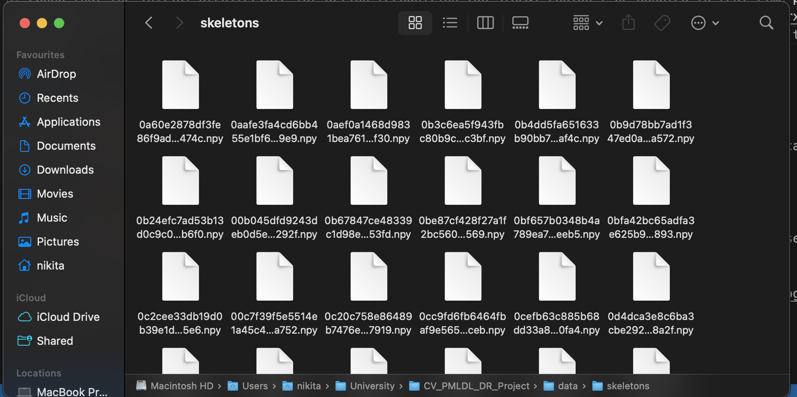
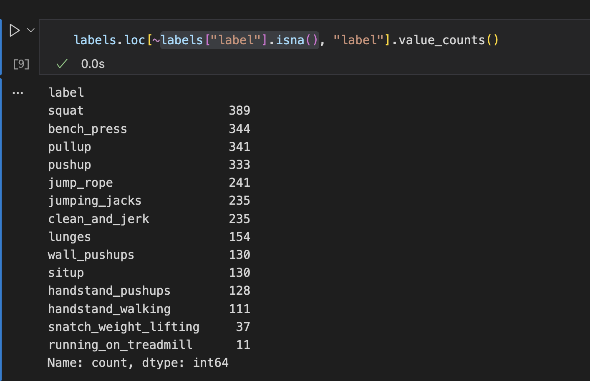

## 1. Team Information (JustTeam)
Members:
- Nikita Tiurkov (n.tiurkov@innopolis.university)
- Viktor Mazanov (v.mazanov@innopolis.university)
- Oleg Shchendrigin (o.shchendrigin@iMarkdown Preview Enhancennopolis.university)

## 2. Github Repository
https://github.com/KosmonikOS/Action_Recognition

## 3. Project Topic
Develop a pipeline that allows for detecting human actions (related to sports activities) in a real-time video stream.

## 4. What has been done so far
1) Collected and preprocessed (converted frames to videos) raw videos and labels from `PennAction`, `UCF101`, and `Kinetics400` datasets. The total number of videos with sport-related actions is 2,819.
2) Excluded videos with multiple people in the frame (this step was done simultaneously with step 3). To simplify the problem, we decided to exclude such videos as otherwise we would have to manually label each person (while accessible datasets usually provide only one label per video). After applying this filter, we've 1,251 videos.
3) Processed videos through pose estimation model ([YOLOv11](https://arxiv.org/pdf/2410.17725v1)) to collect skeleton sequences. As the action classification model will be trained solely on skeleton sequences, this step significantly reduces the size of the dataset (from 25 GB of videos to 21 MB of skeleton sequences).
4) Found that the initial pose estimation model (RTMPose) isn't optimized for M-series GPUs (most of our team uses M-series chips, hence it won't be convenient for us). So, we decided to switch to YOLOv11, which is compatible with M-series GPUs and provides comparable accuracy (mAP@50 [91.1 for YOLOv11](https://docs.ultralytics.com/tasks/pose/#models) vs [90.7 for RTMPose](https://arxiv.org/pdf/2303.07399)).
5) Found that the initial architecture for action recognition (DG-STGCN) couldn't be adapted to real-time prediction, as it requires a window of frames to make a prediction. So, we decided to switch to [InfoGCN++](https://arxiv.org/pdf/2310.10547). This architecture uses a mechanism of future pose prediction, which adds two major benefits: (1) it requires only one frame to make a prediction and (2) it requires much less data to train (check [Table II](https://arxiv.org/pdf/2310.10547) in the paper).

## 5. Results
Here is our dataset looks like now:

where `video_path` and `skeleton_path` are paths to the video and skeleton sequence w.r.t the root of the `data` directory. NaN values correspond to videos with multiple people in the frame.

Each video corresponds to a skeleton sequence of shape (N_frames, 17, 2), where 17 is the number of joints and 2 is the x and y coordinates of the joint. All skeleton sequences are stored in `npy` files.

Here is a distribution of actions in the dataset:

Here we see that most classes are well-represented in the dataset. However, we still have some underrepresented classes (e.g, `snatch_weight_lifting` and `running_on_treadmill`). We will decide what to do with them later.

For the skeleton extraction pipeline, check [extract_skeletons.ipynb](https://github.com/KosmonikOS/Action_Recognition/blob/main/data/scripts/extract_skeletons.ipynb) in GitHub.

## 6. Work Distribution
- Nikita Tiurkov: Experiments with pose estimation models and skeleton extraction pipeline.
- Viktor Mazanov: `Kinetics400` and `UCF101` dataset preparation.
- Oleg Shchendrigin: `PennAction` dataset preparation.

## 7. Plan for the Next Weeks
1. Enrich the dataset with more videos. Here we plan to:
    - Try to find other datasets with sport actions (e.g, `Kinetics600`).
    - Find ways to augment videos in the current dataset.
2. Get familiar with InfoGCN++ official implementation and adjust it to our needs (the initial implementation is for 3D, while we need 2D). Then train the model on the dataset.
3. Analyze the performance of the model. If it won't satisfy us, we could try to first pretrain InfoGCN++ on the huge 3D skeleton dataset (used in the original paper) and then fine-tune it on our dataset.