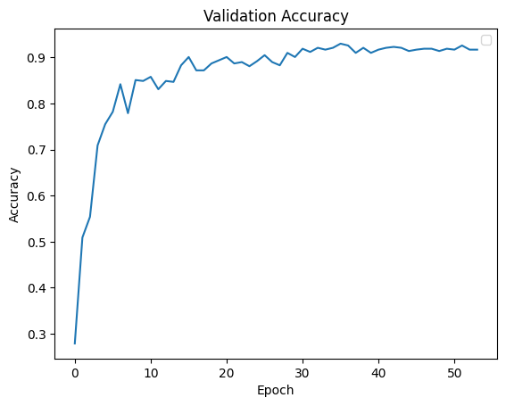
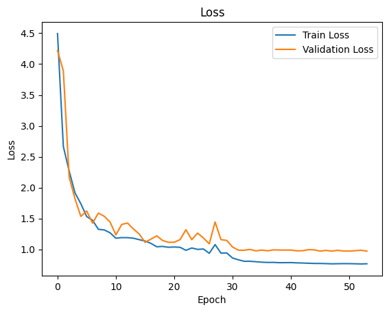

## 1. Team Information (JustTeam)
Members:
- Nikita Tiurkov (n.tiurkov@innopolis.university)
- Viktor Mazanov (v.mazanov@innopolis.university)
- Oleg Shchendrigin (o.shchendrigin@iMarkdown Preview Enhancennopolis.university)

## 2. Github Repository
https://github.com/KosmonikOS/Action_Recognition

## 3. Project Topic
Develop a pipeline that allows for detecting human actions (related to sports activities) in a real-time video stream.

## 4. What has been done so far

Previously, we've collected and unified 3 datasets into a single one. Then applied pose recognition model to collect skeleton sequences.

This time we've:
1) Implement scripts to augment the dataset. This includes:
    - Augmentations on the video level (flipping, color jittering, speed change);
    - Augmentations on the skeleton level (rotating, scaling, translating, jittering, flipping, time cropping, time resampling);
2) Implemented a script to preprocess the extracted skeletons. This preprocessing includes:
    - Interpolating missing joints;
    - Centering and scaling the skeleton;
    - Windowing the skeleton into sequences of fixed length (64 frames) with stride of 64 frames;
3) Recreated InfoGCN++ official implementation and adapted it to the 2D skeletons.
4) Implemented the training pipeline (including data loading, model training, evaluation and saving the model). After training, we've got 0.93 accuracy on the test set.
5) Implemented basic inference pipeline to combine pose estimation and action recognition models. Currently, it's able to process around 34 FPS on M1 Max (32 Gb RAM).

## 5. Results

Here is the pseudo-cod (real implementation is much more complex) of the skeleton-based spatio-temporal ODE (SODE) model we currently use:

```python
def build_model():
    x = load_skeletons()                            # (N, C, T, V, M)

    joints = linear_embed(x, out_dim=base_channel) # per-joint feature lift + learnable joint bias

    z = TemporalEncoder(
        seq_len=T,
        dim=base_channel,
        depth=depth,
        heads=4,
        dim_head=base_channel // 4,
        graph=Graph.A_norm,
    )(joints)                                       # transformer with graph-aware attention

    solver = DiffeqSolver(
        ode_func=ODEFunc(base_channel, Graph.A_norm, N=n_step, T=T),
        method=ode_method,
    )
    z0, z_future, z_future_shifted = extrapolate(solver, z)  # integrate latent trajectories forward in time

    x_hat = ReconDecoder(z_future_shifted)          # graph convolutions reconstruct joint motion

    z_cls = ClsDecoder(concat(z0, z_future))        # fuse current + predicted latents
    logits = TemporalHeads(num_cls)(z_cls)          # per-interval 1D conv classifiers

    return logits, x_hat
```

Currently, we've trained the model for 55 epochs and got 0.93 best accuracy on the test set.

For hyperparameters we've used the same as in the InfoGCN++ official implementation, except for the learning rate which we've set to 1e-2 instead of 0.1 and used 55 epochs instead of 80.

Below is the plot of the validation accuracy during the training:
<p align="center">
  
</p>

Below is the plot of the training and validation loss during the training:
<p align="center">
  
</p>

As we use a custom dataset and this is our first model configuration, we don't have any prior baseline to compare the current results with. However, assuming that we have a balanced labels distribution, 0.93 accuracy is a good absolute result.

## 6. Work Distribution
- Nikita Tiurkov: InfoGCN++ code implementation and adaptation to the 2D skeletons.
- Viktor Mazanov: Skeleton level augmentations.
- Oleg Shchendrigin: Video level augmentations.

## 7. Plan for the Next Weeks
1. Think about the best way to inference the model. We should consider:
    - What runtime should we use (e.g bare PyTorch or ONNX) ?
    - How to make model available for the end-users (e.g. through API or CLI)?
2. Clean up the repository as currently some files aren't properly formatted (apply linters and type checks).
3. Write a comprehensive documentation on how to reproduce the results on external datasets.
4. Start preparing for the final presentation.